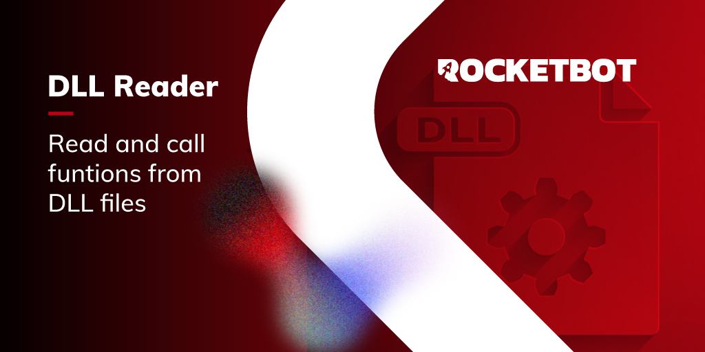

# dll_reader
  
Lee y utiliza funciones desde archivos DLL  

  
*Read this in other languages: [English](Manual_dll_reader.md), [Português](Manual_dll_reader.pr.md), [Español](Manual_dll_reader.es.md)*  

  

## Como instalar este módulo
  
Para instalar el módulo en Rocketbot Studio, se puede hacer de dos formas:
1. Manual: __Descargar__ el archivo .zip y descomprimirlo en la carpeta modules. El nombre de la carpeta debe ser el mismo al del módulo y dentro debe tener los siguientes archivos y carpetas: \__init__.py, package.json, docs, example y libs. Si tiene abierta la aplicación, refresca el navegador para poder utilizar el nuevo modulo.
2. Automática: Al ingresar a Rocketbot Studio sobre el margen derecho encontrara la sección de **Addons**, seleccionar **Install Mods**, buscar el modulo deseado y presionar install.  

## Descripción de los comandos

### Obtener funciones de archivo dll
  
Obtén las funciones disponibles de un archivo dll.
|Parámetros|Descripción|ejemplo|
| --- | --- | --- |
|Ruta a archivo dll|Ruta al archivo dll a leer.|C:\Users\user\Desktop\file.dll|
|Asignar resultado a variable|Asignar resultado de la conexión a variable.|result|

### Ejecutar función
  
Ejecutar una función de un archivo dll.
|Parámetros|Descripción|ejemplo|
| --- | --- | --- |
|Ruta a archivo dll|Ruta al archivo dll a leer.|C:\Users\user\Desktop\file.dll|
|Función|Nombre de la función a ejecutar.|sum|
|Parametros|Lista de paramtros a pasarle a la función.|[2, 2]|
|Tipo de resultado|Seleccione el tipo de variable a recibir de la ejecución de la función.|Integer|
|Asignar resultado a variable|Asignar resultado de la consulta a una variable.|result|
