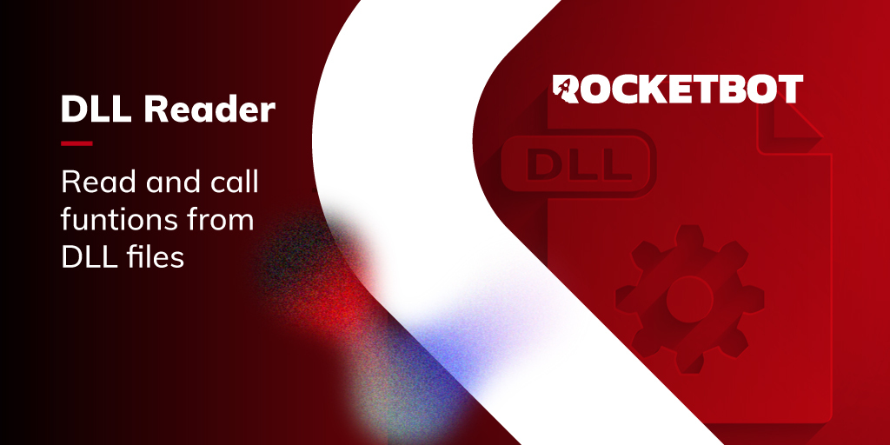

# dll_reader
  
Ler e usar funções de arquivos DLL  

  
*Read this in other languages: [English](Manual_dll_reader.md), [Português](Manual_dll_reader.pr.md), [Español](Manual_dll_reader.es.md)*  

  

## Como instalar este módulo
  
Para instalar o módulo no Rocketbot Studio, pode ser feito de duas formas:
1. Manual: __Baixe__ o arquivo .zip e descompacte-o na pasta módulos. O nome da pasta deve ser o mesmo do módulo e dentro dela devem ter os seguintes arquivos e pastas: \__init__.py, package.json, docs, example e libs. Se você tiver o aplicativo aberto, atualize seu navegador para poder usar o novo módulo.
2. Automático: Ao entrar no Rocketbot Studio na margem direita você encontrará a seção **Addons**, selecione **Install Mods**, procure o módulo desejado e aperte instalar.  

## Descrição do comando

### Obter funções do arquivo dll
  
Obtenha as funções disponíveis de um arquivo dll.
|Parâmetros|Descrição|exemplo|
| --- | --- | --- |
|Caminho para arquivo dll|Caminho para o arquivo dll para ler.|C:\Users\user\Desktop\file.dll|
|Atribuir resultado a variável|Atribuir resultado da conexão a variável.|result|

### Executar função
  
Execute uma função de um arquivo dll.
|Parâmetros|Descrição|exemplo|
| --- | --- | --- |
|Caminho para arquivo dll|Caminho para o arquivo dll para ler.|C:\Users\user\Desktop\file.dll|
|Função|Nome da função a executar.|sum|
|Parâmetros|Lista de parâmetros para passar para a função.|[2, 2]|
|Tipo de resultado|Selecione o tipo de variável a receber da execução da função.|Integer|
|Atribuir resultado a variável|Atribuir resultado da consulta a uma variável.|result|
